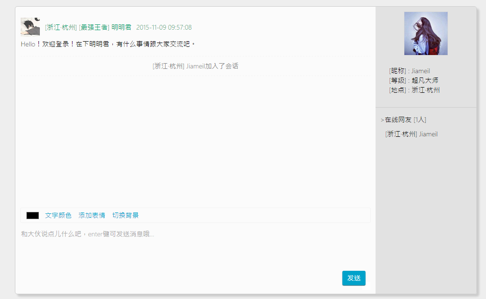

# mingchat
nodeJs 在线聊天室.    
   
[在线地址](http://mingchat.herokuapp.com/)
  
  
    
功能说明：   
1. 切换文字颜色;    
2. 发送表情;   
3. 切换背景图片;  
4. 所在城市显示;    
5. 等级积分制;   
6. 昵称或匿名;

************

> 参考项目git地址：[hichat](https://github.com/wayou/HiChat);         
> 参考详细解读文章：[Node.js + Web Socket 打造即时聊天程序嗨聊](http://www.cnblogs.com/Wayou/p/hichat_built_with_nodejs_socket.html#home);

